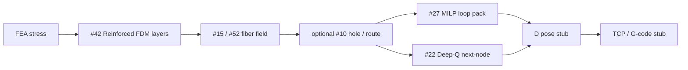

# nonplanarslicer / stress-fiber

Adaptive slicer research scaffold for **stress-aligned curved layers** and **continuous-fiber** planning. Target product home: [github.com/nonplanarslicer/stress-fiber](https://github.com/nonplanarslicer/stress-fiber).

This repository is a clean-room set of Rust algorithm crates + a Vite/React operator UI. It is **not** a validated slicer and does **not** invent paper metrics.

## What the product is

Operators load stress / layer candidates, choose a fiber packing strategy, inspect loop tours, and export a TCP/G-code **stub**. Upstream FEA → curved layers (#42) → fiber fields (#15/#52) → optional hole routing (#10) feed this packer; downstream robot pose stubs (family D) consume the tour.

**NP Pack UI** owns packing (`crates/np-pack`), the app shell (`packages/app`), and this product narrative. **NP Rust Core** and **NP Fiber Fields** own their algorithms — consumed via **napi-rs** (`crates/np-native`), not rewritten here.

## Pipeline



Intended chain: **FEA → #42 → #15|#52 → optional #10 → #27|#22 → D stub**.

## Pick guide — #27 vs #22

| Situation | Pick | Why | Current build |
| --- | --- | --- | --- |
| Small multi-layer loop sets, offline planning, need exact-ish packing | **#27 MILP** | Layer-wise select/omit under spacing, bend radius, budget | **Greedy-by-weight stand-in — NOT a full MILP** |
| Large graphs, local decisions, online replan | **#22 Deep-Q** | Next-node policy on local subgraphs | **Policy interface; falls back to greedy when weights are missing** |
| Smoke test / explicit heuristic | **greedy** | No MILP or policy claim | Deterministic heuristic as labeled |

**Stand-in flags (org-push honesty):** #27 is a **deterministic greedy-by-weight stand-in**, **NOT a full MILP**. #22 is a **policy interface that falls back to greedy when weights are missing**. Both gaps are flagged from the research cards — solver encoding / network / weights are **not** in the FNPS corpus. This repo does **not** invent paper metrics or claim a trained Deep-Q.

## Constraints

| Constraint | Role |
| --- | --- |
| **Bend radius** | Reject loops whose geometry violates machine/fiber minimum |
| **Min spacing / collision order** | Explicit conflict pairs + centroid spacing stand-in |
| **Fiber length budget** | Hard limit on selected length |
| **Cut / restart** | Costed events when the tour jumps; `allow_cuts` gate |

## I/O contracts

### Pack (`np-pack` / `pack_run`)

- **In:** `candidates[]` (`id`, `layer_id`, `points`, `weight`, `length`), `constraints`, `strategy` (`milp`|`deepq`|`greedy`), optional `conflict_pairs`, optional `weights_path`
- **Out:** `selected_loop_ids`, `tour_order`, `cuts`, `strategy`, `solver_status`, `unplaced`, `paths`, `notes`

### Core / Fiber

Unchanged adapters in `packages/api` (`core_run`, `fiber_run`). Pack UI does not rewrite those algorithms.

## Crate / package map

| Path | Owner | Role |
| --- | --- | --- |
| `crates/np-core` | NP Rust Core | #42 stress layers / fill / TCP data |
| `crates/np-fiber` | NP Fiber Fields | #15/#52/#10 field + routing + process checks |
| `crates/np-pack` | NP Pack UI | #27 packing + #22 policy + export stub |
| `crates/np-native` | shared | napi-rs JSON bridge (`core_run`, `fiber_run`, `pack_run`) |
| `packages/api` | shared | TS types + mocks + native injection |
| `packages/app` | NP Pack UI | Vite + React operator UI |

## Implementation gaps (from cards)

- **#27** ([arxiv.org/abs/2404.11404](https://arxiv.org/abs/2404.11404)): solver choice, variable encoding, timing not in corpus → greedy stand-in behind `MilpBackend`.
- **#22** ([arxiv.org/abs/2408.09198](https://arxiv.org/abs/2408.09198)): architecture, reward, dataset, weights not in corpus → `DeepQPolicy` → greedy fallback.
- Interlayer stacking rules and continuous spacing MILP variables not encoded.
- G-code dialect is a **placeholder** (M700–M703); not machine-validated.

## Stack / build

Algorithms are Rust crates exposed through a small **napi-rs** Node addon. The operator shell is **TypeScript + React via Vite** only (no Next/Remix). The web UI uses a deterministic TypeScript mock until a host injects native bindings — keeping `.node` out of the browser bundle while preserving the JSON ABI.

```bash
rustup default stable
# Node 18+, pnpm via corepack or install

cargo check --workspace
cargo test -p np-pack
pnpm install
pnpm --filter @nonplanarslicer/app typecheck
pnpm --filter @nonplanarslicer/app build
pnpm dev
# Optional native addon:
pnpm --filter @nonplanarslicer/native build
```

## UI demo

1. `pnpm dev` → open the Vite URL.
2. Pipeline bar shows FEA→#42→#15|#52→#10?→#27|#22→D.
3. Pick #27 / #22 / greedy (tooltips carry the pick guide).
4. Adjust bend radius, spacing, budget, cut/restart.
5. **Run pack** on synthetic demo loops (labeled example data — not paper metrics).
6. Inspect SVG tour; download G-code stub or JSON.

## Research context

Cards live in the sibling FNPS tree (`../../papers/cards/` from this directory). Public inspiration includes [GuoxinFang/ReinforcedFDM](https://github.com/GuoxinFang/ReinforcedFDM); this project does **not** copy proprietary code.
